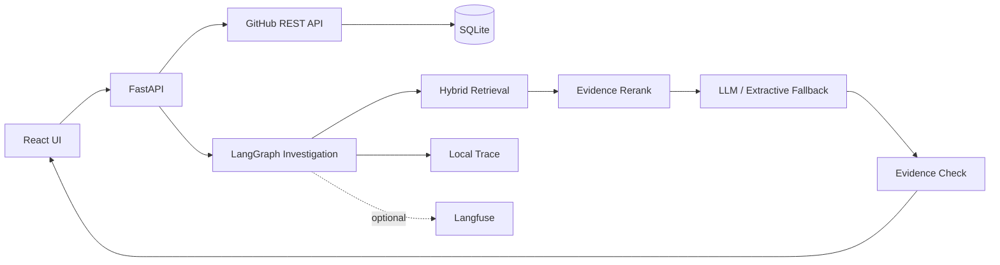

# RepoTrace

RepoTrace 是一个面向 GitHub 项目的历史故障调查工具。

开发者遇到 Bug 时，经常需要在 Issue、Pull Request、Commit 和项目文档之间来回搜索：这个问题以前出现过吗？当时是什么原因？最后改了哪里？RepoTrace 把这条调查链路放到一个地方完成，并把每一步使用的证据保留下来。

当前版本聚焦一个场景：**历史故障调查**。它不会自动修改代码，也不会把一次检索结果包装成“确定结论”。如果证据不足，系统会明确降低置信度。

## 能做什么

- 导入公开 GitHub 仓库的 Issue、PR、Commit、README 和部分 `docs/` 文档
- 使用 BM25 + 字符向量检索，并通过 RRF 合并两路结果
- 对错误码、函数名、Issue 编号和“怎么修”这类修复意图做领域重排
- 通过 LangGraph 编排 `检索 → 重排 → 回答 → 证据检查`
- 支持 OpenAI-compatible LLM；未配置 LLM 时会自动退化为可追溯的证据摘要
- 每次调查都记录本地 Trace，可查看各阶段耗时和命中数量
- 可选接入 Langfuse，把 Agent / Retrieval / Generation 链路导出到外部观测平台
- 内置可重复的检索回归集，避免“改完感觉更准”这种不可验证的优化方式

## 当前检索回归结果

内置 `demo_incidents_v1` 含 8 个故障查询，用于验证检索逻辑和防止回归。它是小型、人工整理的工程回归集，不代表真实公开仓库上的最终效果。

| 方案 | Hit Rate@5 | MRR |
|---|---:|---:|
| BM25 基线 | 87.5% | 0.6292 |
| BM25 + 字符向量 RRF | 100% | 0.7604 |
| Hybrid + 证据重排 | 100% | 1.0000 |

完整过程见 [`docs/evaluation/EVALUATION.md`](docs/evaluation/EVALUATION.md)。

## 架构



V1 使用 SQLite 和本地检索索引，目的是先把故障调查、评估和证据链做扎实。代码关系图、增量索引、真正的语义 Embedding、跨仓库调查等能力放在后续阶段。

## 快速开始

### 1. 后端

```bash
cd backend
python -m venv .venv

# Windows
.venv\Scripts\activate

# macOS / Linux
source .venv/bin/activate

pip install -e ".[dev]"
uvicorn app.main:app --reload --port 8000
```

API 文档：`http://localhost:8000/docs`

### 2. 前端

```bash
cd frontend
npm install
npm run dev
```

浏览器打开：`http://localhost:5173`

Vite 会把 `/api` 请求代理到 `localhost:8000`。

### 3. 配置 LLM

复制环境变量模板：

```bash
cp .env.example .env
```

至少设置：

```env
REPO_TRACE_LLM_ENABLED=true
REPO_TRACE_LLM_BASE_URL=https://opencode.ai/zen/go/v1
REPO_TRACE_LLM_API_KEY=your-key
REPO_TRACE_LLM_MODEL=deepseek-v4-flash
```

`REPO_TRACE_LLM_BASE_URL` 需要填写到 `/v1` 层级，RepoTrace 会调用 `${base_url}/chat/completions`。

不配置 LLM 也能运行。此时系统会展示检索到的证据和 Trace，只跳过生成式归纳。

### 4. GitHub Token（推荐）

公开仓库在不带 Token 的情况下也能访问，但 GitHub REST API 的匿名限额比较低。建议设置：

```env
REPO_TRACE_GITHUB_TOKEN=github_pat_xxx
```

Token 只通过运行时环境变量读取，不应提交到仓库。

## 运行测试与评估

```bash
cd backend
pytest -q
python -m scripts.run_benchmark
```

当前本地测试覆盖检索、仓库地址归一化和 API 健康检查。CI 还会执行 Ruff、pytest coverage、检索 benchmark 和前端 build。

## 项目结构

```text
RepoTrace/
├── backend/
│   ├── app/
│   │   ├── api/              # FastAPI 路由
│   │   ├── core/             # 配置
│   │   ├── models/           # 领域模型
│   │   ├── services/         # GitHub、检索、LLM、Agent、评估
│   │   ├── storage/          # SQLite
│   │   └── support/          # 可重复 demo benchmark
│   ├── scripts/              # benchmark / LLM smoke test
│   └── tests/
├── frontend/                 # React + TypeScript + Vite
├── docs/
│   ├── design/
│   ├── engineering/
│   ├── evaluation/
│   ├── guide/
│   └── roadmap/
└── .github/workflows/ci.yml
```

## 文档

- [产品问题与边界](docs/design/PRODUCT.md)
- [系统设计](docs/design/SYSTEM_DESIGN.md)
- [UI 设计说明](docs/design/UI_DESIGN.md)
- [技术选择与取舍](docs/engineering/TECH_DECISIONS.md)
- [评估与优化记录](docs/evaluation/EVALUATION.md)
- [从代码理解 RepoTrace](docs/guide/UNDERSTANDING_REPOTRACE.md)
- [后续路线](docs/roadmap/ROADMAP.md)

## License

[MIT](LICENSE)
