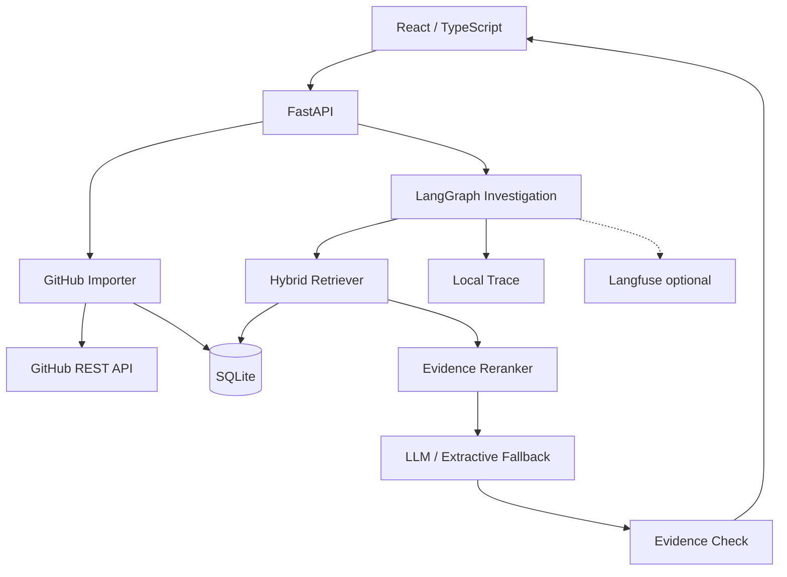
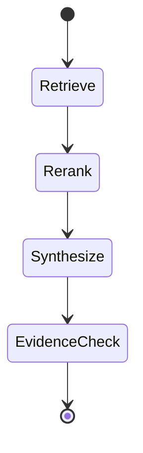

# 系统设计

## 设计目标

第一版有四个优先级：

1. 本地能直接跑；
2. 检索过程能解释；
3. 没有 LLM 也能工作；
4. 每次改检索都能重新评估。

这几个条件比“先上一个完整向量数据库集群”更重要。

## 总体结构



## 数据导入

`GitHubClient` 接收 `owner/repo` 或仓库 URL，第一版导入：

- Issue；
- Pull Request；
- Commit；
- README；
- `docs/`、`doc/` 下有限数量的 Markdown / MDX / TXT 文件。

每一条数据最后都会转换成统一的 `EvidenceDocument`：

```text
id
repo
kind
number
state
title
body
url
metadata
```

这样检索层不用理解 GitHub API 的原始 JSON，也不会把 GitHub 供应商细节传进 Agent 状态。

### 为什么没有第一版就抓所有评论和 PR diff

因为 API 调用量会上升得很快。

一个中等仓库可能有几百条 Issue 和 PR。如果每条再单独请求评论、changed files、review thread，首次导入的请求数很容易从几个请求变成几百个请求。

V1 先抓标题、正文、状态、合并时间、Commit message 和文档。后续真实 benchmark 如果证明“根因经常只存在评论里”，再按相关性二次拉取评论。这比导入阶段全量抓取更合理。

## 检索

### 第一通道：BM25

GitHub 故障数据里经常有这些东西：

```text
401
X-Accel-Buffering
refreshAccessToken
client_max_body_size
src/auth/session.ts
```

这种 token 用词法检索非常合适，所以 BM25 保留为第一通道。

### 第二通道：字符向量

V1 使用 `TfidfVectorizer(analyzer="char_wb", ngram_range=(3, 5))` 作为本地向量通道。

它不等同于语义 Embedding，这一点必须说清楚。选择它的原因是：

- 无模型下载；
- CI 完全可重复；
- 对路径、错误码和标识符变体比较友好；
- 足够验证 Hybrid + Fusion 的工程结构。

语义 Embedding 已经被隔离在检索层边界内，后续可以替换成 BGE / E5 这类模型，而不用改 Agent 和 API。

### 中英调试词扩展

内置 benchmark 第一轮就暴露了问题：

```text
查询：退出登录以后还短暂显示上一个用户头像
历史：Logout leaves cached profile
```

纯 BM25 没有任何公共 token。

V1 增加了一个很小的调试词表，例如：

```text
退出登录 -> logout / sign out
头像     -> avatar / profile
缓存     -> cache / stale
并发     -> concurrent / race
卡住     -> stuck / buffering
```

这个机制目前只是工程兜底，不准备无限扩词表。真实项目里如果中文查询占比很高，更合理的下一步是使用多语语义 Embedding 或 LLM Query Rewrite。

### RRF 融合

BM25 和向量通道的原始分数不在同一个尺度，所以不直接做 `0.5 * scoreA + 0.5 * scoreB`。

RepoTrace 用 Reciprocal Rank Fusion：

```text
RRF(d) = Σ 1 / (k + rank_i(d))
```

它只关心每个通道里文档排第几，对不同检索器的分数范围不敏感。

## 证据重排

Reranker 当前没有再引入一个 Cross Encoder。它利用软件故障调查里很稳定的信号：

- 错误码、函数名、路径精确命中；
- 用户明确指定 `#123`；
- 已合并 PR 比未落地方案更像真实修复；
- 查询包含“怎么修 / 如何解决 / fix / resolve”时，提高 merged PR 的优先级。

这一层故意保持可解释。前端会显示“精确命中”“已合并修复候选”“查询包含修复意图”这类 reason。

## LangGraph 工作流



节点职责很固定：

- `retrieve`：召回候选证据；
- `rerank`：按故障调查信号重排；
- `synthesize`：调用 LLM，或者在没有 LLM 时生成证据摘要；
- `verify`：统计引用和候选质量，给出当前置信度。

这里使用 LangGraph 是因为工作流已经有明确状态，并且未来会自然增加条件分支，比如“证据不足时执行 Query Rewrite 再检索一次”。

## 为什么没用 DeepAgents

DeepAgents 很适合长任务、Todo、文件系统、子 Agent 和上下文压缩。RepoTrace V1 没有这些需求。

如果现在直接上 DeepAgents，最终很可能是为了使用框架而使用框架：Agent 获得了一套通用 harness，但产品场景只需要四个稳定步骤。

后面如果 RepoTrace 加入“读取代码 → 建立假设 → 调用多个工具验证 → 生成调查计划”，那时再考虑 DeepAgents 会更自然。

## LLM 失败策略

LLM 是可选项。

如果调用失败，系统不会让整个调查接口失败，而是返回检索证据摘要。这样能保证：

- GitHub 历史检索仍然可用；
- 用户仍能看到 Issue / PR 链接；
- Trace 里能看到 LLM 阶段发生了什么。

对于 OpenAI-compatible 提供商，如果 `reasoning_effort` 导致 400，客户端会自动去掉这个字段再重试一次。

## Observability

RepoTrace 总是保存本地 Trace：

```text
hybrid_retrieval
  documents: 15
  hits: 12
  duration_ms: 5.04

evidence_rerank
  hits: 6
  duration_ms: 0.22

answer_synthesis
  used_llm: false
  duration_ms: 0.02

evidence_check
  confidence: medium
  duration_ms: 0.04
```

上面的数字来自当前内置 demo 在本地的一次实际执行，仅用于说明链路量级，不代表生产延迟。

Langfuse 是可选导出层。它不参与业务正确性，Langfuse 挂掉也不能让调查失败。
