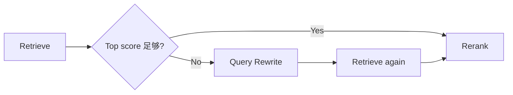

# 从一次 401 调查看懂 RepoTrace

如果第一次打开这个仓库，我建议不要从文件树一个文件一个文件看。最快的方式是跟一条请求走完整个系统。

这篇文章就用下面这个问题：

```text
“登录后偶发 401，refresh token 并发时更明显，最后怎么修？”
```

我们从浏览器按下“开始调查”开始。

## 1. 前端只提交两样东西

`frontend/src/App.tsx` 最终调用：

```ts
api.investigate(selected, question)
```

请求体很简单：

```json
{
  "repository": "owner/repo",
  "question": "登录后偶发 401..."
}
```

这里没有把检索参数暴露给普通用户。

原因是 RepoTrace 当前想解决的是“调查”，不是做一个检索参数 Playground。`top_k`、rerank 数量这些参数放在后端配置里，评估时统一调整。

## 2. FastAPI 把请求交给 InvestigationService

入口在：

```text
backend/app/api/routes.py
```

`POST /api/investigations` 没有业务逻辑，只做请求接收和异常转换：

```text
HTTP request
    ↓
InvestigationService.run()
```

如果你以后加权限、用户、任务队列，也应该尽量让 route 保持薄。

## 3. InvestigationState 是这次 Agent 的共享状态

看：

```text
backend/app/services/investigation.py
```

State 里目前只有这些核心字段：

```python
repository
question
hits
answer
used_llm
confidence
warning
```

LangGraph 节点每跑一步，只更新自己负责的字段。

理解 LangGraph 时，可以先忘掉“Agent”这个词。这里就是：

```text
一个 dict
经过函数 A
增加 hits
经过函数 B
hits 被重新排序
经过函数 C
增加 answer
经过函数 D
增加 confidence
```

LangGraph 帮我们把这条状态流显式组织起来。

## 4. 第一站：HybridRetriever

代码：

```text
backend/app/services/retrieval.py
```

### 4.1 Query Expansion

用户输入中文，但 GitHub 历史可能是英文。

例如：

```text
“退出登录以后头像还在”
```

扩展成：

```text
原始中文 + logout + sign out + avatar + profile
```

目前只是一个很小的调试词表。

你可以把它理解成“先帮检索器补几个它本来听不懂的词”。

### 4.2 BM25

BM25 适合：

```text
401
refreshAccessToken
X-Accel-Buffering
client_max_body_size
```

它会统计 Query token 在不同文档里的区分度和出现频率。

不需要死记公式。看这个项目时，你先记住：**越像错误码、函数名、配置名，BM25 越有价值。**

### 4.3 char TF-IDF vector

第二路不是神经网络 Embedding。

它把文本拆成 3~5 个字符的小片段，再计算向量相似度。优点是轻、稳定、对标识符变体友好。

后面如果换成真正的 multilingual embedding，最应该保留的是接口和评估，不是这一具体实现。

### 4.4 RRF

两路检索得到两个排行榜：

```text
BM25
1. Issue #184
2. PR #201
3. docs/auth.md

Vector
1. PR #201
2. Issue #184
3. Commit abc
```

RRF 不直接比较两边“0.83 和 12.4 谁大”，它只看排名，再融合。

这样不同检索器不用硬做分数归一化。

## 5. 第二站：EvidenceReranker

召回之后的问题变成：

> 我已经找到十几条相关记录，谁应该排最前？

RepoTrace 先利用工程里很便宜的信号。

### 精确标识符

用户写了：

```text
refreshAccessToken
```

某个 PR 正文也包含同样函数名，它就应该得到加分。

### merged PR

如果 Query 是：

```text
“最后怎么修？”
```

描述问题的 Issue 很有用，但已经合并的 PR 更接近“最终处理”。

所以 reranker 会识别修复意图，把 merged PR 往前推。

注意这里的逻辑非常领域化。换成普通知识问答，这个 prior 就没有意义。

## 6. 第三站：LLM

代码：

```text
backend/app/services/llm.py
```

LLM 收到的不是整个仓库，只收到 rerank 后的少量证据：

```text
[E1] PR ...
[E2] Issue ...
[E3] docs ...
```

System Prompt 明确要求：

- 只能根据证据回答；
- 不足就说不足；
- 引用使用 `[E1]`；
- 关注历史问题、根因、修复和建议检查项。

### 为什么 LLM 是可选的

检索证据本身已经有价值。

如果模型服务挂了，RepoTrace 仍然可以告诉你：

```text
最相关的是 #184
其次是 PR #201
这里是原始链接
```

所以调用失败时会进入 extractive fallback，而不是整个接口 500。

## 7. 第四站：Evidence Check

当前 verifier 很简单，它不调用第二个 LLM。

它检查：

- 有没有候选；
- 回答有没有引用证据；
- Top1 分数是否够高。

然后给 `high / medium / low`。

这个 confidence 目前只能用于 UI 提示，不能理解成“83% 概率正确”。

如果以后要把它做严谨，就要单独做 confidence calibration 数据集。

## 8. Trace 为什么是项目核心的一部分

每个阶段都通过 `LocalTrace.step()` 记录：

```text
输入摘要
输出摘要
耗时
状态
错误
```

你调 RAG 时最怕遇到这种情况：

```text
最终答案错了
```

但你不知道：

```text
正确 Issue 根本没召回？
还是召回了但 rerank 掉下去了？
还是证据对了但 LLM 总结错了？
```

Trace 就是把这三个问题拆开。

后面接 Langfuse 也是为了看同一条链，只是外部平台能做更完整的统计和 LLM 观测。

## 9. 从哪里开始改代码

如果你想通过这个项目学习，可以按下面顺序动手。

### 第一次：改一个 Query Expansion

在 `DEBUG_GLOSSARY` 里加入一个词，跑：

```bash
python -m scripts.run_benchmark
```

看指标有没有变。

### 第二次：增加一个 Eval Case

不要先改算法。

先构造一个当前一定会失败的 case，然后运行测试确认它真的失败，再想办法修。

这会比“感觉这个算法应该更高级”有效很多。

### 第三次：替换向量通道

把 `TfidfVectorIndex` 换成一个真正的多语 Embedding 实现，但保持：

```python
score(query) -> list[float]
```

然后比较：

```text
Hit Rate@5
MRR
索引时间
单 Query 延迟
内存
```

如果指标没明显提升，就不要因为“Embedding 更 AI”而强行留下。

### 第四次：让 LangGraph 出现真正的条件边

现在图是线性的。

一个很自然的升级是：



这时 LangGraph 的价值会更明显，因为工作流开始出现分支和重试。

## 10. 最后再碰 DeepAgents

当一次调查开始需要：

```text
先查历史 Issue
再读两个代码文件
再跑 git blame
再看最近 Commit
发现新线索后重新规划
```

这类任务已经接近一个真正的 research / coding harness。

那时再把 DeepAgents 的 planning、filesystem、subagents 引进来，你会很清楚每个能力到底解决什么，而不是先装框架再找场景。

## 一句话记住整个项目

RepoTrace 的代码可以一直变化，但主线别丢：

```text
先把历史证据找对
再把证据排对
最后才让模型解释
```

一旦这个顺序反过来，项目很容易重新变成一个“模型说得挺像”的普通问答应用。
